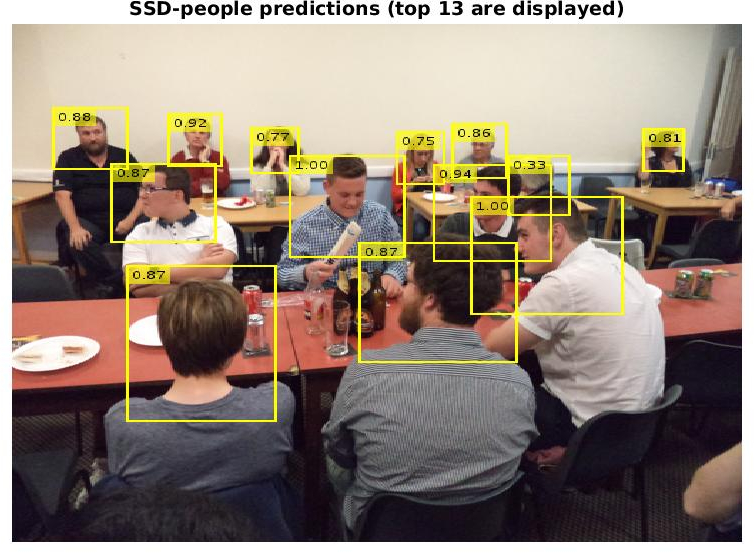

SSD-based upper-body and head detectors
======

<div align="center">
    
</div>

By Pablo Medina-Suarez and Manuel J. Marin-Jimenez.

This repository contains two MatConvNet models for people detection in images: an upper-body detector, and a head detector. These models are based on the [Single Shot Multibox Detector (SSD)](https://arxiv.org/abs/1512.02325), as described in:

```
SSD: Single Shot MultiBox Detector
Authors: Liu, Wei; Anguelov, Dragomir; Erhan, Dumitru; Szegedy, Christian; Reed, Scott; Fu, Cheng-Yang; Berg, Alexander C. 
```

Both models have been trained on the Hollywood Heads Dataset, using the [MatConvNet implementation of SSD](https://github.com/albanie/mcnSSD) developed by Samuel Albanie.

Quick start
------
### Cloning the repository
In order to download the models provided in this repository installation of [git](https://git-scm.com/) and [git-lfs](https://git-lfs.github.com/) is **mandatory**. To do so, run the following commands in command line interface:
```bash
Install git: 	 
	sudo apt-get install git
Install git-lfs:
	sudo apt-get install git-lfs
Set up git-lfs:
	git lfs install
Clone ssd_people from GitHub using the method of your choice: 
	git clone https://github.com/AVAuco/ssd_people.git (HTTPS)
	git clone git@github.com:AVAuco/ssd_people.git (SSH)
```

You can verify the installation by checking that the file size of the files under the `models` directory is approximately 90 MB.

### Running the demo code
Demo code is provided in [ssd_people_demo.m](./ssd_people_demo.m). Running this script will perform detections over 3 sample images using the selected model, showing the results in screen.

To run this script, start MATLAB and setup MatConvNet with contrib modules:
```matlab
% Add MatConvNet to MATLAB's PATH:
addpath /usr/local/matconvnet-25/matlab     % Adapt this path to your setup
vl_setupnn

% Setup mcnSSD and its dependencies
vl_contrib('setup', 'mcnSSD')

% Setup ssd_people
cd <root_ssd_people>  
addpath(genpath(pwd))   % Just in case

% Run demo code on CPU
ssd_people_demo;    % Runs the upper-body detector
ssd_people_demo('model','head');    % Runs the head detector
```

Software requirements
------
Minimal requirements to run the models on the CPU:
- MATLAB (tested on R2016b and R2017a).
    - Demo code requires Parallel Computing, Computer Vision System and Image Processing toolboxes.
- [MatConvNet](http://www.vlfeat.org/matconvnet/) (version >= 1.0-beta25 is recommended because of `vl_contrib`).
- [mcnSSD](https://github.com/albanie/mcnSSD).
    - [autoNN](https://github.com/vlfeat/autonn).
    - [mcnExtraLayers](https://github.com/albanie/mcnExtraLayers).

The following code installs mcnSSD and its dependencies via `vl_contrib`:
```matlab
vl_contrib('install', 'mcnSSD');
vl_contrib('compile', 'mcnSSD');
vl_contrib('setup', 'mcnSSD');

vl_contrib('install','autonn');
vl_contrib('setup','autonn');

vl_contrib('install','mcnExtraLayers');
vl_contrib('setup','mcnExtraLayers');
```

Additional, recommended requirements to run the detectors on the GPU:
- NVIDIA CUDA Toolkit (tested on v8.0 GA2, v9.2 and v10.0).
- **Optional:** a NVIDIA cuDNN version matching the NVIDIA CUDA Toolkit version installed.

Performance
------
Both the upper-body and head detectors use a 512x512 input size, favoring precision over speed. Nonetheless, these models run at an average of 35 Hz on a NVIDIA GTX 1080, allowing real time detections.

Credits
------
We thank the authors of the images used in the demo code, which are licensed under a [CC BY 2.0](https://creativecommons.org/licenses/by/2.0/) license:
- [mounted_police.jpg](./data/mounted_police.jpg), by [FaceMePLS](https://www.flickr.com/people/faceme/).
- [people_drinking.jpg](./data/people_drinking.jpg), by [Ross Broadstock](https://www.flickr.com/people/figurepainting/).
- [rugby_players.jpg](./data/rugby_players.jpg), by [jam_90s](https://www.flickr.com/people/zerospin/).
